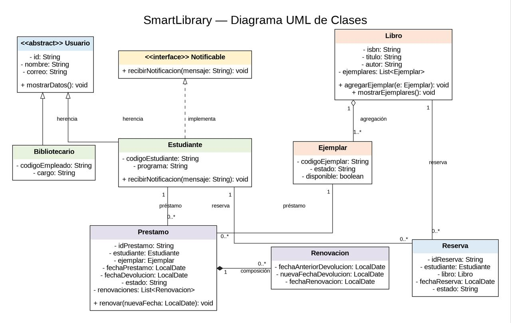
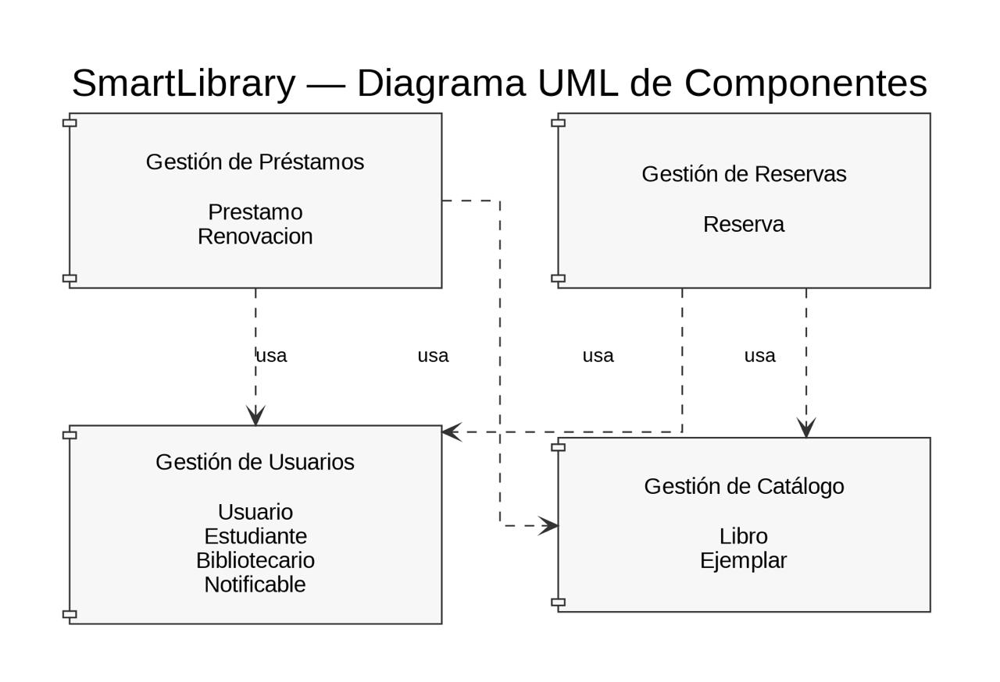
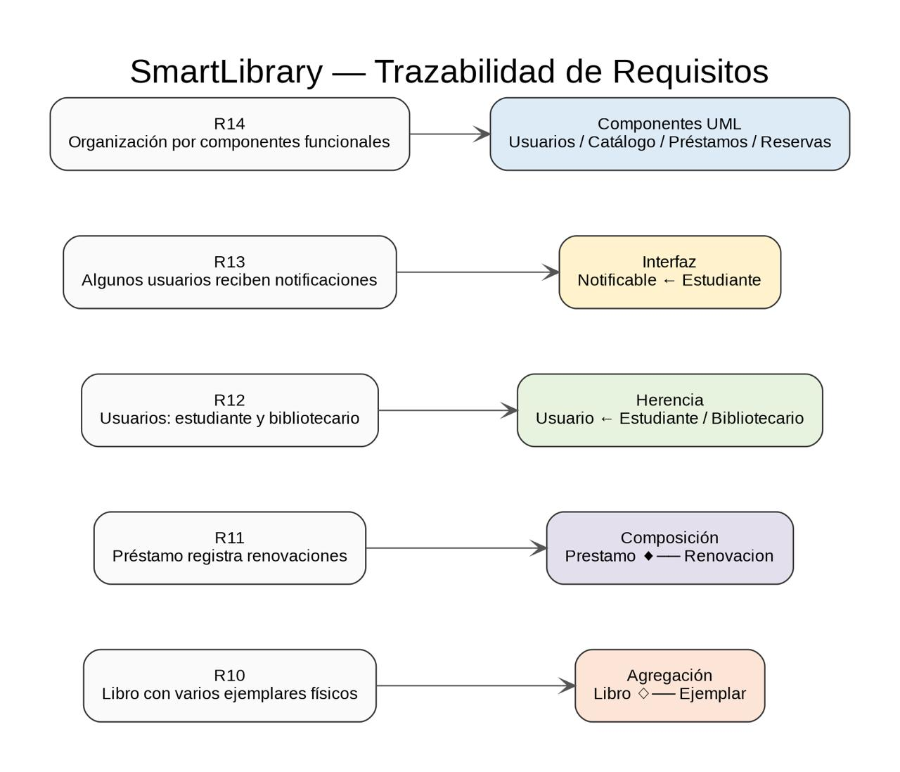

# SmartLibrary

Proyecto académico en Java estándar para un taller de Diseño de Software. Administra usuarios, libros y ejemplares físicos, préstamos con renovaciones, reservas y notificaciones. El ejemplo de `Main` demuestra las relaciones del modelo sin base de datos ni frameworks.

## Requisitos R10–R14

| Requisito | Implementación |
| --- | --- |
| R10 | `Libro` agrega varios `Ejemplar`; cada ejemplar tiene identidad y referencia a un único libro. |
| R11 | `Prestamo` crea y conserva su historial de `Renovacion`, con fecha anterior, nueva y fecha de renovación. |
| R12 | `Usuario` abstracto contiene id, nombre y correo; `Estudiante` y `Bibliotecario` agregan sus datos propios. |
| R13 | `Notificable` define el comportamiento de recibir mensajes y `Estudiante` lo implementa. |
| R14 | Paquetes `usuarios`, `catalogo`, `prestamos` y `reservas` separan las cuatro funciones. |

## Diagramas UML

Las imágenes muestran el diseño; los archivos `.drawio` de `diagramas/` permiten editarlo en draw.io.

### Diagrama de clases



### Diagrama de componentes



### Trazabilidad de requisitos



**Herencia:** Estudiante y Bibliotecario son tipos de Usuario y comparten identificación, nombre y correo. Cada uno conserva sus datos específicos.

**Interfaz:** Notificable ofrece `recibirNotificacion(String)` solo a los tipos que requieren este comportamiento. Estudiante la implementa; Bibliotecario no está obligado a hacerlo.

**Agregación:** Libro reúne referencias a ejemplares creados por separado. El ejemplar tiene `codigoEjemplar` propio y puede existir antes de agregarse. `agregarEjemplar` impide asociarlo a dos libros y evita agregar la misma instancia dos veces.

**Composición:** Prestamo crea sus renovaciones mediante `renovar`. Renovacion no tiene constructor público y su historial pertenece al préstamo; se consulta mediante una lista de solo lectura.

**Asociación:** Prestamo referencia a Estudiante y Ejemplar; Reserva referencia a Estudiante y Libro. Ninguna de estas clases es dueña del ciclo de vida de las otras.

**Componentes UML:** `smartlibrary.usuarios` gestiona usuarios y notificaciones; `smartlibrary.catalogo` gestiona libros y ejemplares; `smartlibrary.prestamos` gestiona préstamos y renovaciones; `smartlibrary.reservas` gestiona reservas. `Main` usa los cuatro paquetes para la demostración.

**Trazabilidad de requisitos:** R10 corresponde a la agregación Libro–Ejemplar; R11, a la composición Prestamo–Renovacion; R12, a la herencia de Usuario; R13, a la interfaz Notificable; R14, a los cuatro paquetes funcionales.

**Justificación de decisiones:** El ejemplar conserva su identidad y no se crea ni destruye con el libro, por eso se modela como agregación. La renovación solo se crea dentro de un préstamo, por eso se modela como composición. Préstamos y reservas guardan referencias a otras entidades sin poseerlas, por eso sus vínculos son asociaciones. La interfaz evita imponer notificaciones a todo Usuario.

## Cómo ejecutar el proyecto

Desde la raíz del proyecto, en PowerShell y con JDK instalado:

```powershell
javac -encoding UTF-8 -d out (Get-ChildItem -Path src -Recurse -Filter *.java).FullName
java -cp out smartlibrary.Main
```

La fecha de renovación se toma de `LocalDate.now()`, por lo que cambia según el día de ejecución.
